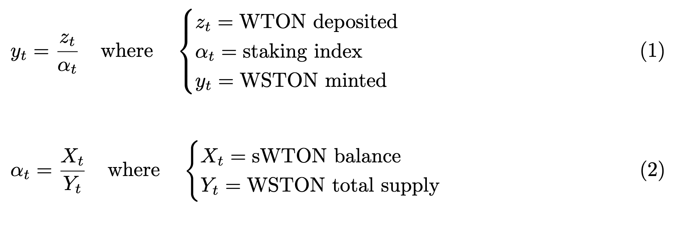

# GEM NFTs

<div align="center">

</div>

## Description

The GEM NFTs project is a sophisticated NFT collection and marketplace centered around Gems. This platform allows users to earn monetary rewards by staking TON tokens. Users engage with a gamified interface to mine new Gems, as well as to buy, sell, and burn them. Additionally, users have the ability to forge two Gems to create a rarer Gem. To acquire WSTON tokens, users can either deposit WTON on Layer 1 (L1) to receive WSTON on the same layer or utilize the WSTON swapper on Layer 2 (L2). L2 WSTON can be used to purchase GEMs at a discounted rate.

When a user claims a mined GEM, the token is assigned randomly using the VDF random beacon. The RandomPack feature allows users to obtain a random GEM in exchange for an upfront fee, with the probability being equally distributed.

GEMs have the following specifications:
- Value: Each Gem has a specific value based on its rarity. For example, a Common Gem inherits a value of 10 WSTON.
- Rarity: There are six different rarity levels: Common, Rare, Unique, Epic, Legendary, and Mythic.
- Quadrants: Each Gem is defined by a set of quadrant numbers. For example, [1, 1, 1, 1] represents a perfect Common Gem, while [2, 2, 2, 2] represents a perfect Rare Gem. A Gem with [2, 1, 1, 1] would have its top-left quadrant associated with a Rare Gem and the other three quadrants associated with a Common Gem. Note that the value for perfect and non-perfect Gems remains the same, as it depends solely on the overall rarity.
- Color: The color of a Gem can be either solid (e.g., solid Turquoise) or gradient (e.g., semi-Amber/semi-Ruby). The color is defined by a ```uint256 color[2]``` variable.
- Cooldown Period: Each GEM holder must wait until the cooldown period elapses before being able to mine that particular GEM.
- Mining Period: Each GEM has a specific mining period, which the holder must wait for before the mining process can be completed.
- Mining Attempts: Gems cannot be mined indefinitely. Once the mining attempts reach zero, the GEM can no longer be mined.
- Random Request: This tracks the random token associated with the GEM when the mining process concludes.
- Token URI: This holds the IPFS address of the metadata file.


## Contracts

### MarketPlace (L2)

The marketplace allows users to list their GEMs for sale at desired prices in WSTON. Interested buyers can pay in L2 TON or L2 WSTON (at a discounted price). Upon successful transfer, the NFT is sent to the new owner. Users can list multiple GEMs for sale in a single transaction using the ```putGemListForSale``` function. Ownership of the NFT is not transferred when calling the ```putGemForSale``` function; instead, the GEM's ```isLocked``` status is set to true, preventing its transfer until it is either purchased or removed from sale.

### Treasury (L2)

The Treasury contract is responsible for creating pools of pre-mined GEMs (admin-only). It handles all transactions made by users, including locking GEM values and holding TON/WSTON tokens in reserve. The admin can list pre-mined GEMs for sale on the marketplace or use the swapper to obtain WSTON. Note that new GEMs cannot be created if the WSTON collateral does not cover the new GEM's value.

### GemFactory (L2)

This contract carries the logic behind GEMs Minting, Forging, mining and melting.
- Minting: there is two cases where NFTs are minted: 
    - When a new Gem is forged, the GEMs used in the process are burned, and a new NFT is minted, inheriting the WSTON value of the burned GEMs (following a specific valuation model).
    - When the admin calls createGEMPool or createGEM from the Treasury contract with specific GEM parameters. The color must exist in the colors array; otherwise, the admin must add the color using the addColor function.
- Forging: any user can forge their GEMs if it respects specific rules:
    - Two Gems must be forged to obtain one Rare Gem, three Rares for one Unique, four Uniques for one Epic, five Epics for one Legendary, and six Legendaries for one Mythic.
    - Users can choose the color of the new token, but it must adhere to specific rules based on the colors of at least two of the tokens forged: 
        - two same solids (ex: [1,1] + [1,1]): the new token color can be [1,1].
        - two different solids (ex: [1,1] + [2,2]): the new token color can be either [1,2] or [2,1].
        - one solid and one gradient & one gradient color is the same as the solid color (ex: [1,1] + [2,1]): the new token color can be [2,1].
        - one solid and one gradient & solid different from both gradients (ex: [1,1] + [3,2]): the new token color can be either [3,1] or [2,1] or [1,3] or [1,2].
        - two same gradients (ex: [1,2] + [1+2]): the new color can be either [1,2] or [2,1].
        - two different gradients (ex: [1,2] + [3,4]): the new color can be either [1,3] or [1,4] or [2,3] or [2,4] or [3,1] or [4,1] or [3,2] or [4,2].
    - Quadrants are calculated by summing the quadrants of each Gem. If the sum is even, the new Gem's quadrant will match the next rarity base quadrant number. If the sum is odd, the next rarity quadrant base number is incremented by one. If the result is a perfect Gem, the last quadrant is decremented by one to avoid jumping two levels in rarity.
- Mining: Users must wait for the cooldown period to elapse before mining a Gem. After initiating mining, they must wait for the mining period to complete before randomly selecting and claiming a Gem. The probability of obtaining a Gem is equally distributed across the pool of pre-mined Gems, but users cannot obtain a Gem rarer than the one they are mining with.
- Melting: Melting burns the GEM and sends the associated WSTON from the Treasury to the user.

### RandomPack (L2)

This contract allows users to obtain a random GEM from the pre-mined GEM pool (held in the Treasury) in exchange for an upfront fee. The fee rate can be customized by the admin. The VDF random beacon is used to generate a random value, which runs an off-chain node and calls the ```fulfillRandomWords``` function to transfer ownership of the selected GEM. If no GEM is available in the pool, a new perfect Common GEM is minted, provided there are sufficient funds in the Treasury contract.

### L1WrappedStakedTON (L1)

This contract is responsible for staking users' WTON and minting WSTON for the same user. WSTON is an indexed token whose value is pegged to TON * stakingIndex. The staking index evolves over time based on the seigniorage received by the pool of sWTON owned by the contract.
<div align="center">

</div>

- Staking Index: The value of WSTON increases as the pool receives more seigniorage, rewarding long-term depositors in line with the Layer 2 candidate reward distribution. The staking index is updated before each deposit or requestWithdrawal transaction.
- Note: An instance of L1WrappedStakedTON must be created for each Layer 2 candidate (e.g., Titan, Thanos). This is done through the L1WrappedStakingTONFactory contract.


## Installation

1.  Clone this repository.
```
git clone https://github.com/tokamak-network/gem-nft-contracts
cd gem-nft-contracts
```

2. install foundry dependencies (foundry must be installed and updated first. See foundry [documentation](https://book.getfoundry.sh/getting-started/installation) for more info)
```
forge install
```

3. install hardhat dependencies (optionnal)
```
yarn install
```

4. Compile 
```
forge compile
```

5. Test
```
forge test
```

## Code Review instruction

Below is the list of contracts to be reviewed

|         Smart Contract Name           |      nSLOC      |
|---------------------------------------|-----------------|
| common/AuthControl.sol                | 61              |
| common/AuthRole.sol                   | 5               |
| L1/L1WrappedStakedTON.sol             | 169             |
| L1/L1WrappedStakedTONFactory.sol.sol  | 25              |
| L1/L1WrappedStakedTONProxy.sol        | 5               |
| L1/L1WrappedStakedTONStorage.sol      | 28              |
| L2/GemFactory.sol                     | 604             |
| L2/GemFactoryProxy.sol                | 5               |
| L2/GemFactoryStorage.sol              | 113             |
| L2/L2StandardERC20.sol                | 38              |
| L2/MarketPlace.sol                    | 116             |
| L2/MarketPlaceStorage.sol             | 24              |
| L2/MarketPlaceProxy.sol               | 5               |
| L2/RandomPack.sol                     | 83              |
| L2/RandomPackStorage.sol              | 24              |
| L2/RandomPackProxy.sol                | 5               |
| L2/Treasury.sol                       | 170             |
| L2/WstonSwapPool.sol                  | 116             |
| L2/WstonSwapPoolStorage.sol           | 20              |
| L2/WstonSwapPoolProxy.sol             | 5               |
| L2/Randomness/DRBConsumerBase.sol     | 30              |
| library/ForgeLibrary.sol              | 193             |
| library/GemLibrary.sol                | 35              |
| library/MiningLibrary.sol             | 15              |
| library/TransferLibrary.sol           | 19              |
| proxy/ProxyGemFactory.sol             | 97              |
| proxy/ProxyL1WrappedStakedTON.sol     | 97              |
| proxy/ProxyMarketPlace.sol            | 97              |
| proxy/ProxyRandomPack.sol             | 97              |
| proxy/ProxyStorage.sol                | 7               |
| proxy/ProxyWstonSwapPool.sol          | 97              |
| **Total**                             | **2379**        |

## Contract addresses

Titan Sepolia
```
TON_ADDRESS=0x7c6b91D9Be155A6Db01f749217d76fF02A7227F2
TITAN_WRAPPED_STAKED_TON=0x256Cf034962292C111436F43e5d92a9EC24dcD3C
DRB_COORDINATOR_MOCK=0xe960E5E63e811812b2F5287D026f1aa6cA67E7f6
GEM_FACTORY=0xE7A2448cd6C52DD932F87F31B4CE11430FdE5Db0
TREASURY=0x1958f59fdb4a5956Ef7bDed3d1fa929fd42524d6
MARKETPLACE=0xFFdd70F0f6d8D1b62937F382FF92D14793cbDE36
WSTON_SWAP_POOL=0x9dbFDA1De782a918E8d8e9c355da830A5ee70d6E
RANDOM_PACK=0xA662bEC667FE4670DB4DB33120B2D6B89885fe45
```

Ethereum Sepolia
```
L1_WRAPPED_STAKED_TON=0x17Ddb5CEaE35A40a520c4DcF1f70409BE9a25406
```

## Contact

For any inquiries, you can reach me through [my GitHub profile](https://github.com/mehdi-defiesta)

Or you can leave a message on the GitHub forum. 